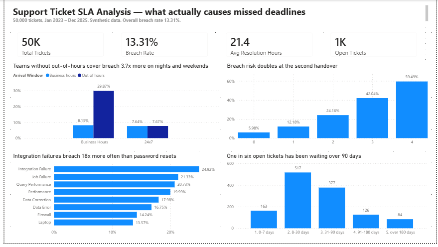

# Support Ticket SLA Analysis

**What actually causes IT support tickets to miss their deadlines — and which causes are worth fixing.**

SQL Server · Python · Power BI · 50,000 tickets · Jan 2023 – Dec 2025

---

## The business problem

IT support organisations are measured on SLA compliance. When breaches rise, the
default response is usually to ask for more headcount.

This analysis asks a different question: **which operational factors actually
drive breaches, and which of them can be fixed without hiring anyone?**

Five questions were defined before any data was generated:

1. What is the overall breach rate, and how does it vary by priority?
2. Does reassignment predict breach, and at what point does risk jump?
3. Which problem types breach most, after adjusting for ticket volume?
4. Is there a time-of-day, day-of-week or shift pattern?
5. Is the open backlog ageing?

---

## Executive summary

**Overall SLA breach rate: 13.31%** — 6,487 of 48,733 resolved tickets. The
remaining 1,267 tickets are still open and excluded from the rate, since an
unresolved ticket cannot yet be judged against its target.

Three drivers explain most of the failure:

| Finding | Impact |
|---|---|
| **Coverage gap** — tickets arriving outside business hours at teams without out-of-hours cover | **~2,600 breaches (40%)** |
| **Handovers** — tickets reassigned twice or more | **20% of volume, 52% of breaches** |
| **Problem difficulty** — integration failures vs password resets | **18× spread in breach rate** |

**These drivers overlap and cannot be added together.** A ticket can arrive at
2am, be reassigned three times, and be a difficult problem type — it appears in
all three figures.

**The practical conclusion:** the largest single driver is a rota problem, not a
skills problem or a headcount problem. That makes it the cheapest thing on the
list to fix.

---



---

## The strongest finding, and why it holds up

Teams **with** 24×7 cover and teams **without** it were compared across the same
nights and weekends.

| Team coverage | Ticket arrived | Tickets | Breach rate |
|---|---|---|---|
| 24×7 | Business hours | 10,451 | 7.64% |
| 24×7 | **Out of hours** | 5,749 | **7.67%** |
| Business hours only | Business hours | 20,582 | 8.15% |
| Business hours only | **Out of hours** | 11,951 | **29.87%** |

The 24×7 teams act as a **control group**. They handle the same out-of-hours
tickets and their breach rate does not move — 7.64% versus 7.67%.

So the cause is not that night-time tickets are harder. It is that for some teams
there is nobody there. Had out-of-hours tickets at business-hours-only teams
performed like their in-hours tickets, **2,596 fewer tickets would have breached
— 40.0% of every breach in the dataset.**

---

## Answers to all five questions

| # | Question | Answer |
|---|---|---|
| 1 | Breach rate by priority | **13.31%** overall. Worst on **P2 (18.11%)**, not P4 (11.06%) — tight windows are harder to hit than long ones |
| 2 | Does reassignment predict breach? | Yes. Risk roughly doubles at each of the first two handovers: 5.98% → 12.18% → 24.16%, reaching 59.49% by the fourth |
| 3 | Which problem types breach most? | **18× spread.** Integration failures 24.92%, password resets 1.39%, on near-identical volumes |
| 4 | Time-of-day or shift pattern? | Yes — and it is **coverage, not time**. See above |
| 5 | Is the backlog ageing? | 1,267 open tickets. **One in six has been open over 90 days**; the oldest open P1 is 738 days |

Full analysis with every table, count, recommendation and limitation:
**[docs/findings.md](docs/findings.md)**

---

## Two things this analysis deliberately does not claim

**Handovers are the biggest lever, but not the whole problem.** Breach *counts*
are almost flat across handover levels — 1,599 / 1,493 / 1,284 / 1,243 / 868 —
because first-touch tickets have the lowest rate but the highest volume.
Eliminating every handover would remove roughly half of all breaches, not all of
them.

**One question initially returned no finding.** An earlier version of the dataset
produced category breach rates between 13.4% and 15.0% — a spread smaller than
random variation at this sample size. That was noise, not a finding, and
reporting the top row as "the worst category" would have been wrong. Recognising
it and correcting the model is documented in
[docs/findings.md](docs/findings.md).

---

## A note on the data

**This dataset is synthetic**, generated by
[`src/generate_tickets.py`](src/generate_tickets.py). No client or production
data was used.

Every behavioural assumption — priority mix, handover cost, category difficulty,
shift coverage, backlog ageing — is an explicit, editable value in a single
configuration block at the top of that script. The analysis quantifies the
consequences of those assumptions; it cannot validate whether the assumptions
themselves are correct. That would require real ticket data.

The random seed is fixed, so anyone running these scripts gets **exactly the
numbers shown here**.

Full limitations are listed in [docs/findings.md](docs/findings.md).

---

## What was built

### SQL Server

- **Schema defined explicitly** — ten tables with data types chosen per column,
  primary keys, eight foreign key constraints, `UNIQUE` constraints, and `CHECK`
  constraints that make invalid data impossible to insert (a ticket cannot be
  resolved before it was created; elapsed time must equal work time plus hold
  time)
- Indexes on filtered and joined columns
- A reporting view (`vw_ticket_first_assignment`) that flattens the first-touch
  team onto each ticket, so the BI layer receives a simple shape
- Analysis using `JOIN`, `GROUP BY`, `HAVING`, `CASE WHEN` conditional
  aggregation, `UNION ALL`, `DATEPART`, `DATEDIFF`, and `INFORMATION_SCHEMA`
- A repeatable data quality report covering row counts, impossible values,
  orphan foreign keys, null rates and distribution checks

### Python

- Two seeded generators producing eight dimension tables and two fact tables
- Lognormal distributions for durations, because task times have a long right
  tail rather than a symmetrical spread
- Dirichlet distribution to split elapsed time across handling teams
- Loading via SQLAlchemy with explicit date parsing and `fast_executemany`

### Power BI

- Star schema model built on the database's own foreign keys
- Marked date table
- DAX measures using `CALCULATE`, `DIVIDE`, `COUNTROWS`, `AVERAGE`
- Calculated columns using `VAR`, `SWITCH`, `DATEDIFF`
- Four-visual dashboard, every number reconciled against its SQL equivalent

### Git

Feature branches and pull requests throughout, with conventional commit messages.

---

## Reproducing this

Requires SQL Server (Express is fine), Python 3.11+, and Power BI Desktop.

```bash
git clone git@github.com:govardhani-data/support-ticket-sla-analytics.git
cd support-ticket-sla-analytics

python -m venv .venv
.\.venv\Scripts\Activate.ps1
pip install -r requirements.txt
```

Then:

1. In SSMS: `CREATE DATABASE SupportTicketDB;`
2. Run `sql/01_schema/01_create_tables.sql`
3. `python src/generate_dimensions.py`
4. `python src/generate_tickets.py`
5. `python src/load_dimensions_to_sql.py`
6. `python src/load_facts_to_sql.py`
7. Run `sql/01_schema/02_create_views.sql`
8. Run `sql/03_analysis/01_data_quality_checks.sql` — every check should pass
9. Run `sql/03_analysis/02_five_questions.sql` to reproduce every figure above
10. Open `powerbi/support-ticket-sla-dashboard.pbix`

---

## Repository structure

```
support-ticket-sla-analytics/
│
├── src/
│   ├── generate_dimensions.py      eight lookup tables, seeded
│   ├── generate_tickets.py         50,000 tickets + 88,000 assignment events
│   ├── load_dimensions_to_sql.py
│   └── load_facts_to_sql.py
│
├── sql/
│   ├── 01_schema/
│   │   ├── 01_create_tables.sql    tables, keys, constraints, indexes
│   │   └── 02_create_views.sql     reporting view for Power BI
│   └── 03_analysis/
│       ├── 01_data_quality_checks.sql
│       └── 02_five_questions.sql   every figure in this README
│
├── powerbi/
│   └── support-ticket-sla-dashboard.pbix
│
├── docs/
│   ├── findings.md                 full analysis
│   ├── data-model.md               schema design and reasoning
│   └── images/
│
├── data/                           raw and processed data (gitignored)
├── requirements.txt
└── README.md
```

---

## What I would do next

- **Validate the assumptions.** Category difficulty and the out-of-hours penalty
  are informed estimates, not measurements. Real ticket data would confirm or
  correct them.
- **Model real working calendars** per team rather than a single 09:00–18:00
  window, including regional public holidays.
- **Analyse first-response SLA.** The data contains a separate first-response
  target per priority; this version covers resolution SLA only.
- **Separate the overlapping drivers.** The 40% and 52% figures describe
  overlapping populations. A regression would isolate each driver's independent
  contribution.
- **Add cost-to-serve**, so breaches can be ranked by financial impact rather
  than count.

